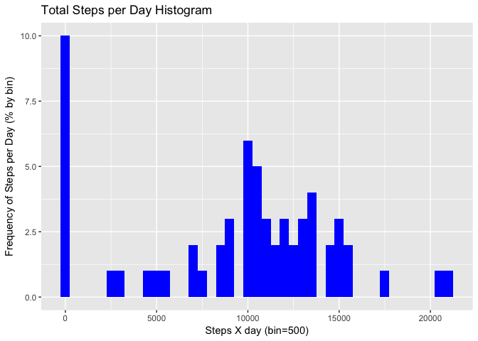
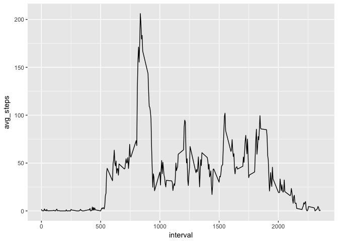
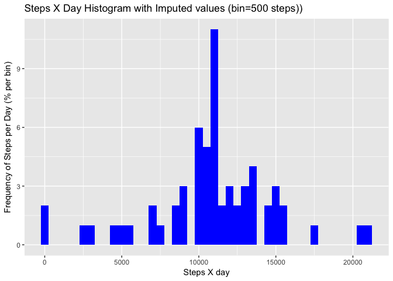
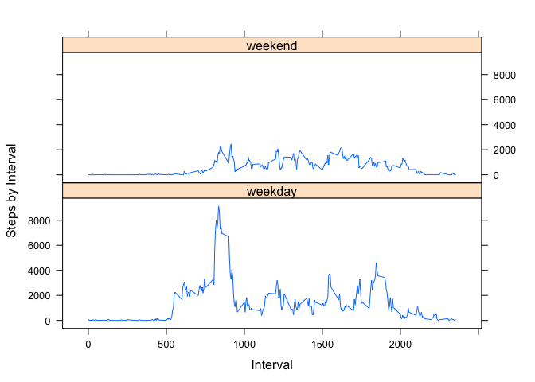

# Reproducible Research - Assignment 01 (Feb 25)
Andrew Nix  
2/25/2017  
##Introduction to Assignment
(Intro copy/pasted from: https://www.coursera.org/learn/reproducible-research/peer/gYyPt/course-project-1 )

It is now possible to collect a large amount of data about personal movement using activity monitoring devices such as a Fitbit, Nike Fuelband, or Jawbone Up. These type of devices are part of the “quantified self” movement – a group of enthusiasts who take measurements about themselves regularly to improve their health, to find patterns in their behavior, or because they are tech geeks. But these data remain under-utilized both because the raw data are hard to obtain and there is a lack of statistical methods and software for processing and interpreting the data.

This assignment makes use of data from a personal activity monitoring device. This device collects data at 5 minute intervals through out the day. The data consists of two months of data from an anonymous individual collected during the months of October and November, 2012 and include the number of steps taken in 5 minute intervals each day.

The variables included in this dataset are:  

1) steps: Number of steps taking in a 5-minute interval (missing values are coded as 𝙽𝙰)
2) date: The date on which the measurement was taken in YYYY-MM-DD format  
3) interval: Identifier for the 5-minute interval in which measurement was taken


## 1. Code for reading in the dataset and/or processing the data

```r
#set working directory
setwd("/Users/Andy/Desktop/Coursera/Assignments_AND_Datasets/Reproducible Research- Assignment 01")

#create data frame from csv
activity_df <-read.csv("activity.csv")

# review the structure of the data frame
str(activity_df)
```

```
## 'data.frame':	17568 obs. of  3 variables:
##  $ steps   : int  NA NA NA NA NA NA NA NA NA NA ...
##  $ date    : Factor w/ 61 levels "2012-10-01","2012-10-02",..: 1 1 1 1 1 1 1 1 1 1 ...
##  $ interval: int  0 5 10 15 20 25 30 35 40 45 ...
```

```r
# review the summary of the data frame
summary(activity_df)
```

```
##      steps                date          interval     
##  Min.   :  0.00   2012-10-01:  288   Min.   :   0.0  
##  1st Qu.:  0.00   2012-10-02:  288   1st Qu.: 588.8  
##  Median :  0.00   2012-10-03:  288   Median :1177.5  
##  Mean   : 37.38   2012-10-04:  288   Mean   :1177.5  
##  3rd Qu.: 12.00   2012-10-05:  288   3rd Qu.:1766.2  
##  Max.   :806.00   2012-10-06:  288   Max.   :2355.0  
##  NA's   :2304     (Other)   :15840
```

```r
#need to convert date variable from factor to date for ggplot code to work 
activity_df$date <- as.Date(as.character(activity_df$date))

class (activity_df$date)
```

```
## [1] "Date"
```
Observations:  
        - Because date was classified as a factor variable, I went ahead and converted it to class "date"
        - there are 2304 NA's; these me need to be imputed or otherwise dealt with    (e.g. converted to 0 if determined to be indicative of "0 steps" during those intervals) for some analyses


## 2. Histogram of the total number of steps taken each day


```r
#Because the data is presented in 5 minute intervals we need to sum up the intervals by day in order to get the total # of steps by day
stepsXday_agg<-aggregate(activity_df$steps, by=list(activity_df$date),FUN=sum,na.rm=TRUE)

#For consistency, let's ensure the column names are consistent with the original data frame 
colnames(stepsXday_agg)<-c("date","steps")

#Now we can create a histogram showing the frequency of "Total steps per day"
library(ggplot2)
```

```
## Warning: package 'ggplot2' was built under R version 3.3.2
```

```r
ggplot(stepsXday_agg, aes(x = steps)) +
  geom_histogram(fill = "blue", binwidth = 500) +
  labs(title = "Total Steps per Day Histogram", x = "Steps X day (bin=500)", y = "Frequency of Steps per Day (% by bin)")
```

<!-- -->

Observation:
The large number of days with 0 steps raises alarms.


```r
# total days with 0 steps 
sum(stepsXday_agg$steps==0)
```

```
## [1] 8
```

```r
# total days included in the analysis
length(stepsXday_agg$steps)
```

```
## [1] 61
```

```r
# proportion of days with 0 steps out of total observation days 
sum(stepsXday_agg$steps==0)/ length(stepsXday_agg$steps)
```

```
## [1] 0.1311475
```
Observations: 
- There are a significant number of days with 0 steps per day (per the below code ~ 13%). This proportion seems highly unlikely (unless perhaps the person was bed-ridden on those days?), suggesting that we should probably remove these dates from the analysis.  
- However, since this is a practice exercise and not real life, I'm going to keep things simple and not dig any deeper for now :) 
- I will address this in more detail under #s 6 and 7 below

## 3. Mean and median number of steps taken each day

```r
 mean(stepsXday_agg$steps,na.rm = TRUE)
```

```
## [1] 9354.23
```

```r
 median(stepsXday_agg$steps,na.rm = TRUE)
```

```
## [1] 10395
```
Observation:
The median observation is probably a better estimate in this case due to the issue described above (i.e. the likely invalid 0 steps per day observations)


## 4. Time series plot of the average number of steps taken  
Notes related to the creation of this plot:  
- the x axis refers to the time interval within the typical day, and the y-axis refers to the average steps taken during those intervals -- so the left side of the axis refers to the early morning hours (presumably starting at 12:00 AM) and the right side refers to the late evening hours
- the interval values on the x-axis correspond to hours in the day such that 500=5:00 am, 1000=10:00 am, 1500=3:00 pm, etc. 


```r
#calculate the average steps per interval throughout the day
stepsXinterval_mean<-aggregate(activity_df$steps, by=list(activity_df$interval),FUN=mean,na.rm=TRUE)
colnames(stepsXinterval_mean)<-c("interval","avg_steps")

# time series plot 

ggplot(stepsXinterval_mean, aes(interval, avg_steps)) + geom_line() 
```

<!-- -->
Observation: 
Not surprisingly, there are times during the typical day where there is very little walking (e.g. while the subject is presumably sleeping in the hours between 12 and 5 am) and other times where the subject is more active (peak time appears to be around 8 or 9 am) and takes a significant # of steps.  

##5. The 5-minute interval that, on average, contains the maximum number of steps

```r
subset(stepsXinterval_mean, avg_steps== max(stepsXinterval_mean$avg_steps, na.rm=TRUE))
```

```
##     interval avg_steps
## 104      835  206.1698
```
Observation:
Consistent with the time series chart, the interval including the max # of steps is the 8:35-8:40 AM interval.

##6. Code to describe and show a strategy for imputing missing data

First, let's see if there are any patterns around NA values, as it relates to interval. (***we already noted under #2 above that there were 8 days where there were no steps reported***) 

```r
NAxInterval_list<-aggregate(steps ~ interval, data=activity_df, function(x) {sum(is.na(x))}, na.action = NULL)

 nrow(subset(NAxInterval_list, steps==8))
```

```
## [1] 288
```

```r
 nrow(subset(NAxInterval_list, steps<8 | steps>8))
```

```
## [1] 0
```
Observations:
- All 288 intervals are associated with exactly 8 days where there were NA values.  It is safe to assume that all of these intervals are associated with the 8 days that are associated with 0 steps. 
- Based on this info, we can conclude that these days should be excluded from the analysis entirely or should be imputed in some way.
- For this analysis we will attempt to impute them based on the overall average values for those intervals (excluding the missing values)


```r
#using the merge function, I'll create a new data frame that adds an  additional column for avg_steps (sourced from the "stepsXinterval_mean" that was created earlier )
merged_df <- merge(activity_df, stepsXinterval_mean, by="interval")
#need to convert the "avg_steps"column to an integer value (rounding up to the nearest integer in this case) so it is in the same class as "steps" and we can integrate these 2 sets of values in our "final_steps" column
merged_df$avg_steps<-as.integer(ceiling(merged_df$avg_steps))
#create a data frame to hold our final set of values
merged_df_final<-merged_df
#the "final_steps" will be drawn from the "steps" column (same as the original values) where the value is not NA
merged_df_final$final_steps<-merged_df$steps
#create a logical vector for the NA values
steps.na<-is.na(merged_df$steps)
#where there are NA values, they are replaced with the values in the avg_steps column
merged_df_final$final_steps[steps.na]<-merged_df$avg_steps[steps.na]

head(merged_df_final)
```

```
##   interval steps       date avg_steps final_steps
## 1        0    NA 2012-10-01         2           2
## 2        0     0 2012-11-23         2           0
## 3        0     0 2012-10-28         2           0
## 4        0     0 2012-11-06         2           0
## 5        0     0 2012-11-24         2           0
## 6        0     0 2012-11-15         2           0
```
Observations:
- Please note that in the first data row -- where the old "steps" value was "NA", the "final_steps" value is now 2 (rounded up from ~1.7).
- The values that were previously associated with an integer are the same in both the "steps" and "avg_steps"" columns

##7. Histogram of the total number of steps taken each day after missing values are imputed


```r
#Using the new data frame of imputed values in the "final_steps" column, a new vector is created that aggregrates the final values by day
stepsXday_agg_imputed<-aggregate(merged_df_final$final_steps, by=list(merged_df_final$date),FUN=sum,na.rm=TRUE)
colnames(stepsXday_agg_imputed)<-c("date","steps")

#A histogram is created based on these results 
  ggplot(stepsXday_agg_imputed, aes(x = steps)) +
  geom_histogram(fill = "blue", binwidth = 500) + 
labs(title = "Steps X Day Histogram with Imputed values (bin=500 steps))", x = "Steps X day", y = "Frequency of Steps per Day (% per bin)")
```

<!-- -->
Observation: 
This histogram is very similar to the histogram created earlier, but there are now no values associated with 0 "steps per day", the frequency of all other values is now higher, and it much more closely follows the expected normal distribution.

##8. Panel plot comparing the average number of steps taken per 5-minute interval across weekdays and weekends  

Before creating the panel plot, we need to:
1)  create a factor variable that indicates which dates are associated with weekdays vs weekend days; and 
2)  aggregate the # of steps based on this new variable across the range of intervals


```r
# create a vector containing the days of the week for "weekdays"
weekdays1 <- c("Monday", "Tuesday", "Wednesday", "Thursday", "Friday")

#Use `%in%` and `weekdays` to create a logical vector   
#convert to factor variable and label as a "weekday" or a "weekend" depending on whether the value is TRUE or FALSE
merged_df_final$wDay <- factor((weekdays(merged_df_final$date) %in% weekdays1), 
         levels=c(FALSE, TRUE), labels=c('weekend', 'weekday')) 

#now we can sum up the total steps by interval across all time intervals (238 each for weekday and weekend)
steps_SumXwdayAndinterval<-aggregate(steps~wDay+interval, data=merged_df_final, sum, na.rm=TRUE)

head(steps_SumXwdayAndinterval)
```

```
##      wDay interval steps
## 1 weekend        0     0
## 2 weekday        0    91
## 3 weekend        5     0
## 4 weekday        5    18
## 5 weekend       10     0
## 6 weekday       10     7
```

Here's the actual plot


```r
library(lattice)
xyplot(steps ~ interval| levels(steps_SumXwdayAndinterval$wDay), 
            data = steps_SumXwdayAndinterval,
            type = "l",
            xlab = "Interval",
            ylab = "Steps by Interval",
            layout=c(1,2))
```

<!-- -->

Observations from plot:
- This individual appears to have a later start on the weekends with no burst of activity in the morning.
- Overall, it seems fair to say that this individual is less active overall on the weekends.  He/she should probably get out more! 

Just out of curiosity... average steps on weekends vs weekdays


```r
tapply(steps_SumXwdayAndinterval$steps,steps_SumXwdayAndinterval$wDay,mean)
```

```
##   weekend   weekday 
##  603.0972 1378.1806
```


